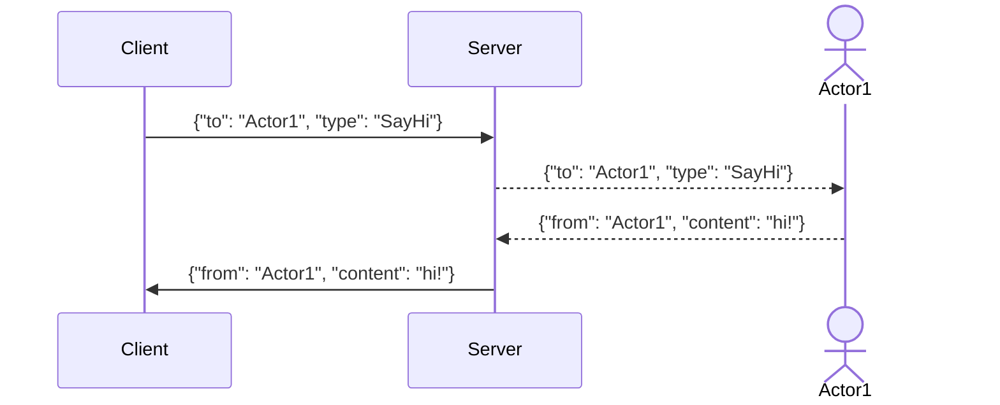

# DevTools

[Firefox DevTools](https://firefox-source-docs.mozilla.org/devtools-user) on joukko web-kehittäjätyökaluja, joilla voi tarkastella, muokata ja debugata verkkosivun HTML:ää, CSS:ää ja JavaScriptiä.
Servo tukee osajoukkoa DevTools-toiminnallisuudesta, mikä mahdollistaa yksinkertaisen debuggauksen.

## Yhdistäminen Servoon

1. Aja servoshell DevTools-palvelin käytössä.
   Luku `devtools`-parametrin jälkeen on palvelimen käyttämä portti.

```sh
./mach run --devtools=6080
```

2. Avaa Firefox ja siirry osoitteeseen `about:debugging`.
   Jos käytät DevTools-integraatiota ensimmäistä kertaa, siirry **Setup**-välilehdelle ja lisää `localhost:6080` [verkkosijainniksi](https://firefox-source-docs.mozilla.org/devtools-user/about_colon_debugging/index.html#connecting-over-the-network).
   Porttinumeron on oltava sama kuin edellisessä vaiheessa.

3. Napsauta sivupalkissa **Connect** kohdan `localhost:6080` vieressä.


4. Palaa Firefoxissa, valitse webview ja napsauta **Inspect**.
   Uuden ikkunan pitäisi avautua sivun inspectorilla.


## Inspectorin käyttö

Inspector-ikkuna on jaettu eri välilehtiin, joilla on eri työtiloja.
Tällä hetkellä **Inspector** ja **Console** toimivat.

**Inspector**-välilehdellä on kolme saraketta.
Vasemmalta oikealle:

- **HTML tree** näyttää dokumentin solmut.
  Tämän avulla voit nähdä, lisätä tai muokata attribuutteja kaksoisnapsauttamalla tagin nimeä tai attribuuttia.
- **style inspector** näyttää valitun elementin CSS-tyylit.
  Merkinnät tulevat elementin style-attribuutista, vastaavista tyylitiedoston säännöistä tai perittynä muilta elementeiltä.
  Tyylejä voi lisätä tai muokata napsauttamalla selektoria tai ominaisuutta, tai napsauttamalla tyhjää tilaa alapuolella.
- **extra column** sisältää lisähyödyllisiä työkaluja:
  - **Layout** sisältää tietoa elementin box model -ominaisuuksista.
    Huomaa, että flex ja grid eivät vielä toimi.
  - **Computed**, joka sisältää kaikki CSS-[computed values](https://drafts.csswg.org/css-cascade/#computed) suhteellisten yksiköiden kaltaisten asioiden ratkaisemisen jälkeen.


**Console**-välilehti sisältää JavaScript-konsolin, joka liittyy Servossa näytettävään verkkosivustoon.
Virheet, varoitukset ja tiedot, joita verkkosivusto tuottaa, kirjataan tänne.
Sitä voi käyttää myös JavaScript-koodin suorittamiseen suoraan verkkosivustolla, esimerkiksi dokumentin sisällön muuttamiseen tai sivun uudelleenlataamiseen:

```js
document.write("Hello, Servo!")
location.reload()
```

<div class="warning">

DevTools-ominaisuuksien tuki on yhä kesken, ja se voi rikkoutua tulevissa Firefox-versioissa, jos viestintäprotokollaan tulee muutoksia.
</div>

## DevToolsin kehittäminen

Lue täydellinen [protokollakuvaus](https://firefox-source-docs.mozilla.org/devtools/backend/protocol.html) syvällistä katsausta varten tärkeistä käsitteistä.

- **Client:** Frontend, joka sisältää eri työkalupaneelit (Inspector, Debugger, Console, ...) ja lähettää pyyntöjä palvelimelle.
  Tällä hetkellä tämä on Firefoxin `about:debugging`-sivu.
- **Server:** Selain, jota client tarkastelee. Vastaanottaa viestit ja välittää ne sopivalle actorille, jotta se voi vastata.
- **Actor:** Koodi palvelimella, joka voi vaihtaa viestejä clientin kanssa.
- **Message:** JSON-paketti, jota vaihdetaan palvelimen ja clientin välillä.
  - Clientin viesteissä on oltava `to`-kenttä actorin nimellä, jolle ne on suunnattu, ja `type`-kenttä, joka määrittää paketin tyypin.
  - Palvelimen viesteissä on oltava `from`-kenttä actorin nimellä, joka lähettää ne.



### Protokollaliikenteen näyttäminen

<div class="warning _note">

Siirry [Protokollaliikenteen kaappaus ja käsittely](#capturing-and-processing-protocol-traffic) -osioon hyödyllisempää työkalua lokianalyysiin varten.
</div>

#### Servo ↔ Firefox

Servo voi näyttää DevTools-palvelimelle lähetetyt ja sieltä vastaanotetut viestit.
Ota käyttöön oikea lokitaso `devtools`-moduulille:

```sh
RUST_LOG="error,devtools=debug" ./mach run --devtools=6080
```

Tulosteessa lähetetyt viestit on etuliitteellä `<-` ja vastaanotetut viestit ilman etuliitettä.
Tässä näemme, miten Servo lähettää alkuyhteyden tiedot ja Firefox vastaa yhteyspyynnöllä ja versionumerollaan.

```
[2025-11-07T11:37:35Z INFO  devtools] Connection established to 127.0.0.1:47496
[2025-11-07T11:37:35Z DEBUG devtools::protocol] <- {"from":"root","applicationType":"browser","traits":{"sources":false,"highlightable":true,"customHighlighters":true,"networkMonitor":true}}
[2025-11-07T11:37:35Z DEBUG devtools::protocol] {"type":"connect","frontendVersion":"144.0.2","to":"root"}
[2025-11-07T11:37:35Z DEBUG devtools::protocol] <- {"from":"root"}
```

#### Firefox ↔ Firefox

Paljon työtä Servon kehittäjätyökalujen parantamiseksi vaatii **reverse-engineering**-työtä Firefoxin toimivasta toteutuksesta.
Yksi tehokkaimmista tavoista on tarkkailla onnistunutta sessiota Firefoxissa ja tallentaa kaksisuuntaista protokollaliikennettä palvelimen ja clientin välillä.

<div class="warning _note">

**Ensimmäisellä ajolla**

1. Luo uusi Firefox-profiili komennolla `firefox --createprofile devtools-testing`.
1. Käynnistä Firefox komennolla `firefox --new-instance -P devtools-testing`.
1. Avaa about:config ja napsauta "Accept the Risk and Continue".
1. Muuta seuraavat asetukset:

```sh
# To see logs in the terminal window
browser.dom.window.dump.enabled = true
devtools.debugger.log = true
devtools.debugger.log.verbose = true
# To enable debugging
devtools.chrome.enabled = true
devtools.debugger.remote-enabled = true
# Optional, avoids having to confirm every time there is a connection
devtools.debugger.prompt-connection = false
```
</div>

Kun Firefox on konfiguroitu, se voidaan käynnistää terminaalista DevTools-palvelin päällä:

```sh
firefox --new-instance --start-debugger-server 6080 -P devtools-testing
# (on macOS you may need `/Applications/Firefox.app/Contents/MacOS/firefox`)
```

Tässä tapauksessa voit käyttää samaa Firefox-instanssia sekä clientina että palvelimena. "This Firefox" -vaihtoehtoa ei kuitenkaan suositella, koska se ei anna pääsyä välilehtiin ja viestit voivat olla erilaisia.
Sen sijaan, käytitpä samaa vai eri instanssia, seuraa [Yhdistäminen Servoon](#connecting-to-servo) -osion ohjeita ohittaen ensimmäinen vaihe.

Terminaali-ikkuna sisältää nyt täydet debug-palvelinlokit; kopioi ne johonkin myöhempää analyysia varten.

### Protokollaliikenteen kaappaus ja käsittely

Olemme nähneet yksinkertaisen tavan hankkia viestilokeja Servosta ja Firefoxista.
Tämä kuitenkin monimutkaistuu nopeasti, kun halutaan vertailla lokia näiden välillä eri formaattien vuoksi tai suorittaa kyselyitä niihin.
Prosessin helpottamiseen on pieni skripti: [`etc/devtools_parser.py`](https://github.com/servo/servo/blob/main/etc/devtools_parser.py).

Se perustuu [Wireshark](https://www.wireshark.org/)-verkkopakettianalysaattoriin; tarkemmin sen CLI-työkaluun `tshark`.
Se on konfiguroitu lokittamaan paikallisverkossa lähetetyt paketit portissa, jossa DevTools-palvelin pyörii.
Se voi lukea näiden pakettien payloadit, jotka ovat pieniä paloja JSON DevTools -protokollasta.

**`tshark` on asennettava**, jotta skripti toimii.
Asenna se paketinhallinnalla tai hanki täydellinen Wireshark-julkaisu [viralliselta sivustolta](https://www.wireshark.org/download.html).

```sh
# Linux (Debian based)
sudo apt install tshark
# Linux (Arch based)
sudo pacman -S wireshark-cli
# Linux (Fedora)
sudo dnf install wireshark-cli
# MacOS (With homebrew):
brew install --cask wireshark
# Windows (With chocolatey):
choco install wireshark
```

Saatat joutua lisäämään käyttäjäsi wireshark-ryhmään rootless-kaappausten sallimiseksi. Käytä `usermod -a -G wireshark $USER`.

Varmista lopuksi [Firefox-profiilin asettaminen debuggausta varten](#on-the-first-run).

#### Sessio kaappaus

1. Aja joko Servo tai Firefox DevTools-palvelin käytössä:

```sh
./mach run --devtools 6080
firefox --new-instance --start-debugger-server 6080 -P devtools-testing
```

2. Toisessa terminaalissa käynnistä skripti capture-tilassa (`-w`) määrittäen saman portin kuin aiemmin:

```
./etc/devtools_parser.py -p 6080 -w capture.pcap
```

3. Yhdistä `about:debugging`-sivulta seuraamalla [samoja ohjeita](#connecting-to-servo).
4. Suorita kaikki toiminnot, jotka haluat tallentaa.
5. Paina `Ctrl-C` parseria ajavassa terminaalissa lopettaaksesi tallennuksen. Tämä tekee kaksi asiaa:
    - Tallentaa tulokset `.pcap`-tiedostoon, jonka määritit `-w`-lipulla. 
      Tämä on Wiresharkin binääritiedostomuoto, mutta voimme lukea sen myöhemmin samalla työkalulla.
    - Tulostaa viestilokin. 
      On kaksi tilaa: tavallinen, jossa viestit tulostetaan ystävällisessä muodossa, ja `--json`, joka tuottaa rivierotetun JSONin jokaisesta viestistä.
6. Voit nyt sulkea Servon tai Firefoxin.

#### Kaappauksen lukeminen

On hyödyllistä tallentaa useita kaappauksia ja vertailla niitä myöhemmin.
Vaikka `tshark` tallentaa ne oletuksena `.pcap`-muodossa, voimme käyttää samaa skriptiä parempaan tulostukseen.
Tässä `--json`-valitsin on hyvin hyödyllinen, koska se mahdollistaa työkalujen kuten [`jq`](https://jqlang.org/) tai [`nushell`](https://www.nushell.sh/) käytön datan kyselyyn ja manipulointiin.

```sh
# Pretty print the messages
./etc/devtools_parser.py -r capture.pcap
# Save the capture in an NDJSON format
./etc/devtools_parser.py -r capture.pcap --json > capture.json
# Example of a query with jq to get unique message types
./etc/devtools_parser.py -r capture.pcap --json | jq -cs 'map({actor: (.from//.to) | gsub("[0-9]";""), type: .type} | select(.type != null)) | .[]' | sort -u
```

<div class="warning _note">

JSON-kaappaus voidaan tallentaa alusta asti komennolla `./etc/devtools_parser.py -w capture.pcap --json > capture.json`.
</div>

Tässä on katkelma kaappauksen tulosteesta:

```json
{"to": "root", "type": "getRoot"}
{"from": "root", "deviceActor": "device1", "performanceActor": "performance0", "preferenceActor": "preference2", "selected": 0}
{"to": "device1", "type": "getDescription"}
{"from": "device1", "value": {"apptype": "servo", "version": "0.0.1", "appbuildid": "20251106175140", "platformversion": "133.0", "brandName": "Servo"}}
```
