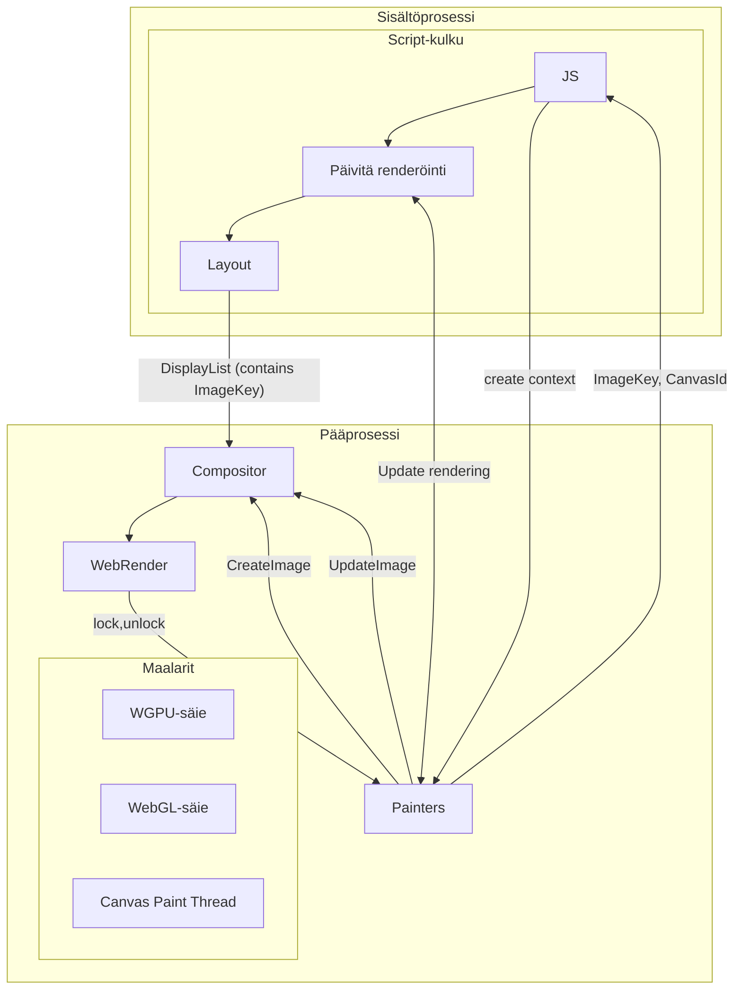
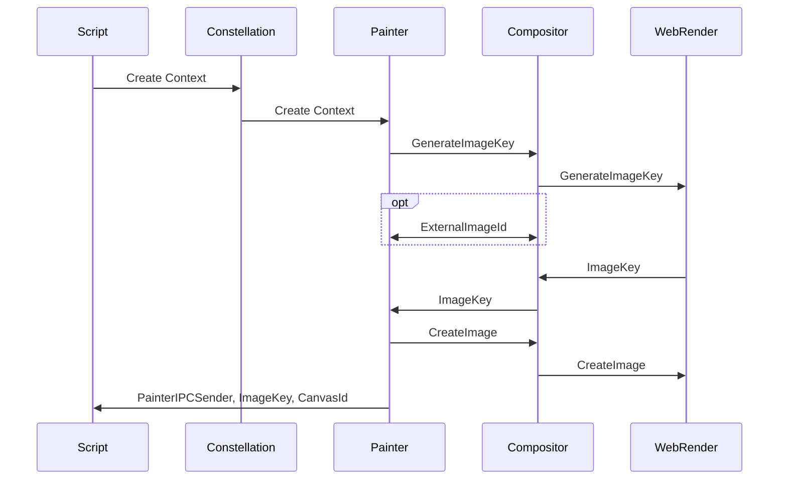
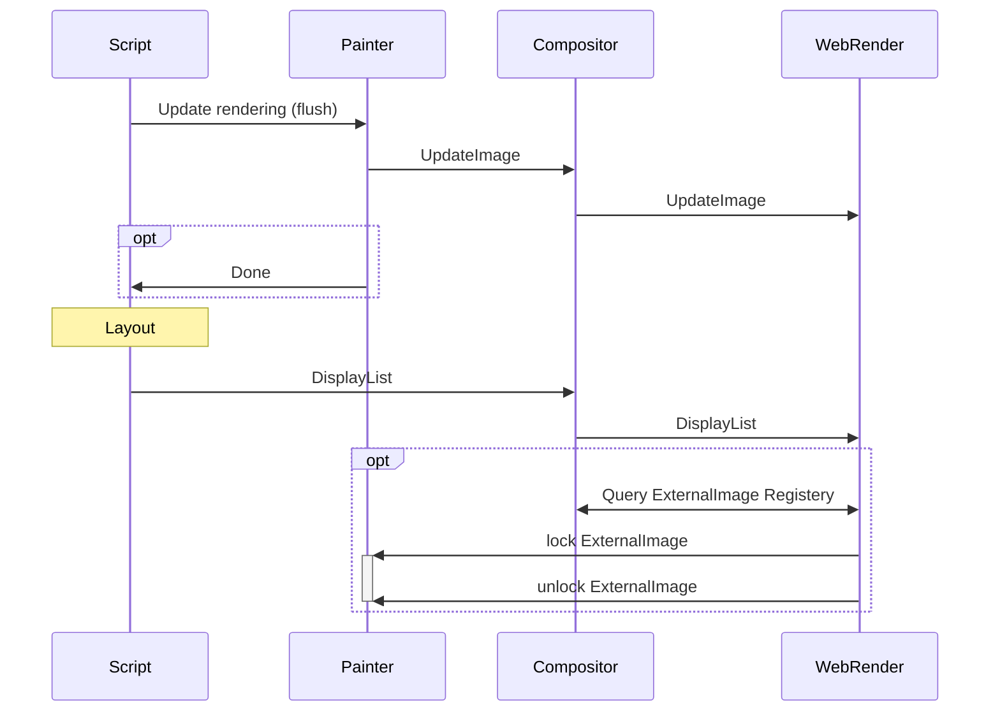
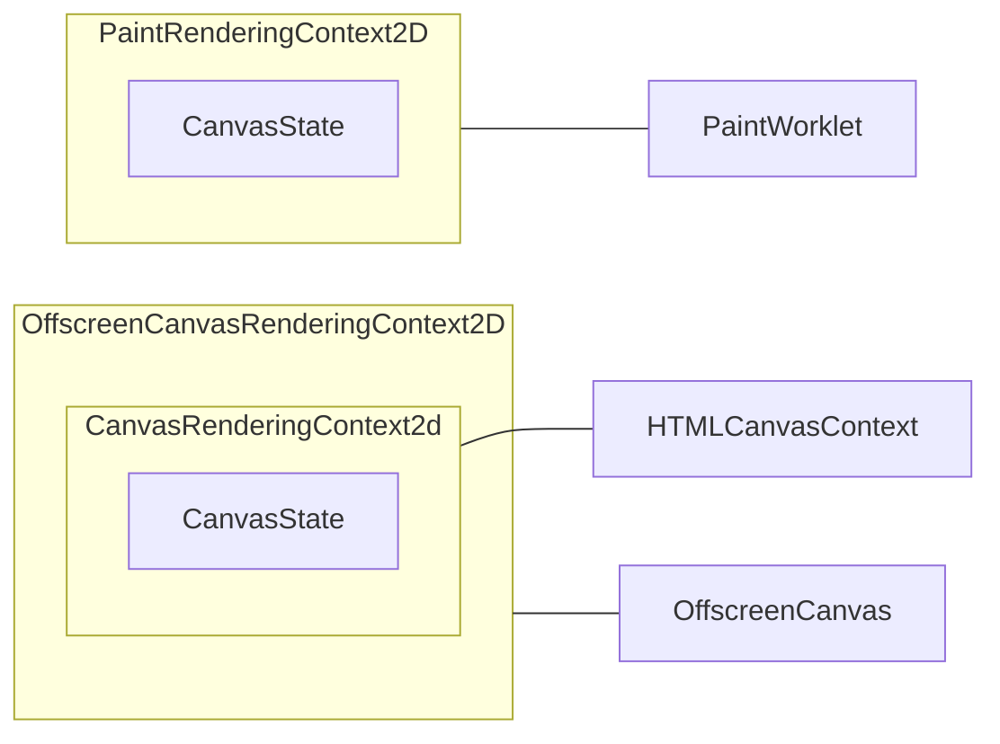
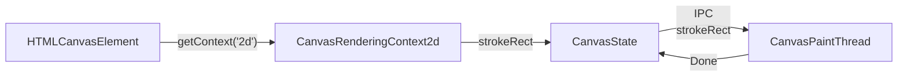
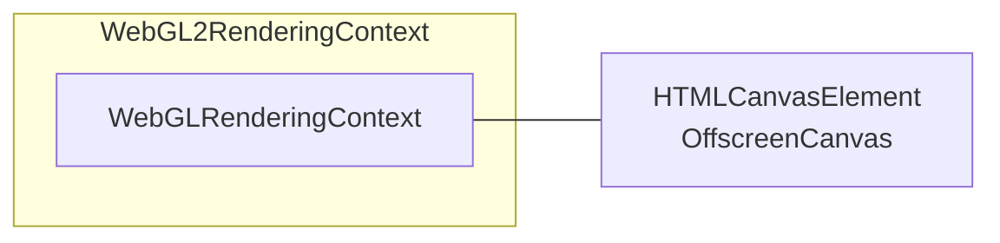
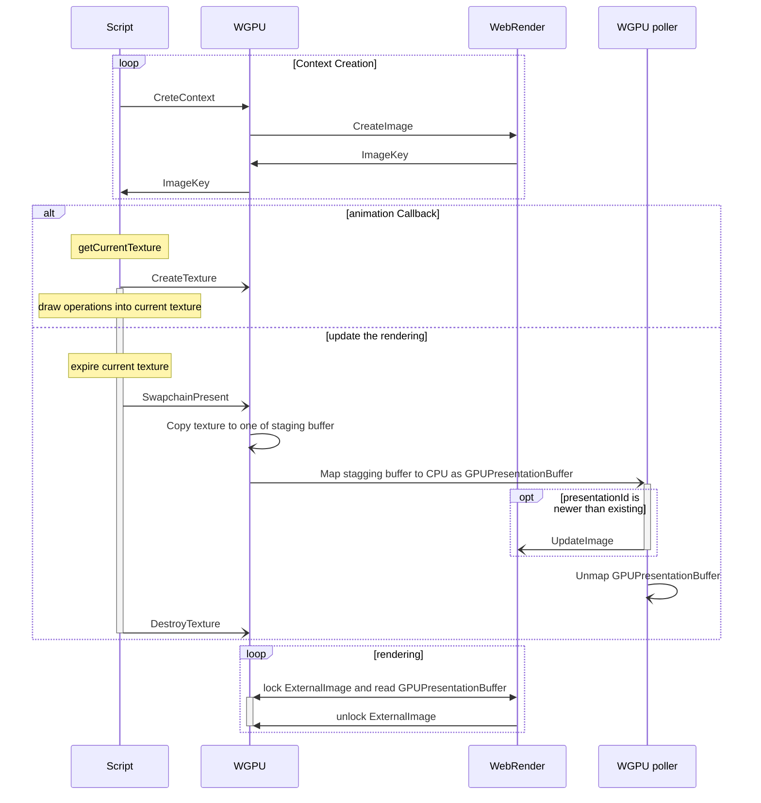
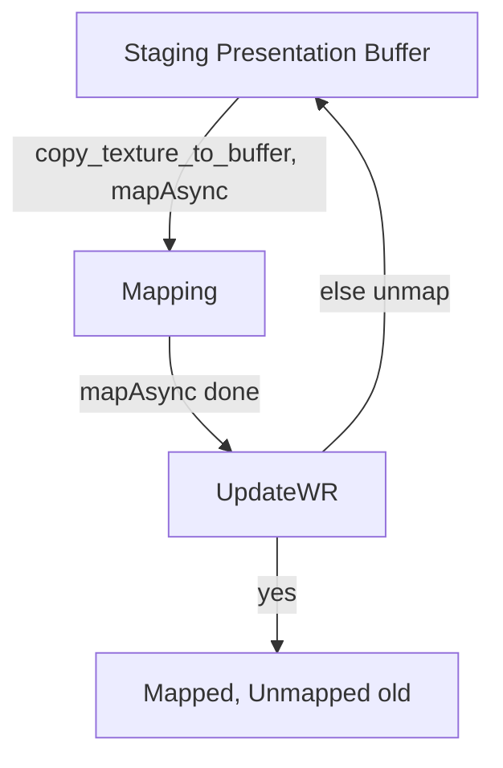

# Canvas

Servo tukee neljää canvas-kontekstityyppiä:

- [`CanvasRenderingContext2D`](https://github.com/servo/servo/blob/3babf7498656b9ff41b9d7894849a1921c68f28f/components/script/dom/canvasrenderingcontext2d.rs#L41) (`2d`-konteksti)
- [`WebGLRenderingContext`](https://github.com/servo/servo/blob/3babf7498656b9ff41b9d7894849a1921c68f28f/components/script/dom/webglrenderingcontext.rs#L173) (`webgl`-konteksti)
- [`WebGL2RenderingContext`](https://github.com/servo/servo/blob/3babf7498656b9ff41b9d7894849a1921c68f28f/components/script/dom/webgl2renderingcontext.rs#L95) (`webgl2`-konteksti)
- [`GPUCanvasContext`](https://github.com/servo/servo/blob/3babf7498656b9ff41b9d7894849a1921c68f28f/components/script/dom/webgpu/gpucanvascontext.rs#L65) (`webgpu`-konteksti)

Jokainen canvas-konteksti toteuttaa [`CanvasContext`-traitin](https://github.com/servo/servo/blob/4f8d816385a5837844a3986cda392bb6c0464fe6/components/script/canvas_context.rs#L26), joka vaatii kontekstien toteuttavan joitakin yhteisiä ominaisuuksia yhtenäisellä tavalla:

- `context_id`
- `resize`: tämä metodi tyhjentää maalarin kuvan asettamalla sen läpinäkyväksi alfaksi (kaikki tavut nolliksi)
- `get_image_data`: käytetään canvas-kuvan hankkimiseen, yleensä kutsumalla `toDataUrl`, `toBlob`, `createImageBitmap` canvas-elementillä tai epäsuorasti piirtämällä yhden canvasin toiseen
- `update_the_rendering`: renderöinnin päivityksen käynnistämiseen (yleensä vaihtamalla screen-buffer ja back-buffer)
- `canvas`: hanki kytketty canvas-elementti (tämä voi olla `HTMLCanvasElement` tai `OffscreenCanvas`, joka voidaan myös kytkeä `HTMLCanvasElement`-elementtiin kontekstilla `placeholder`) samalla tarjoten hyviä oletustoteutuksia (`onscreen`, `origin_is_clean`, `size`, `mark_as_dirty`). `mark_as_dirty` kutsutaan funktioista, jotka vaikuttavat maalarin kuvaan, ja se kertoo layoutille renderöimään canvas-elementin uudelleen (merkitsemällä `HTMLCanvasElement` likaiseksi solmuksi).

## HTML-tapahtumasilmukka ja renderöinti

HTML-tapahtumasilmukan osana script-säie suorittaa tehtävän (jäsentäminen, skriptin evaluointi, callbackit, tapahtumat, ...) ja sen jälkeen se [suorittaa microtask-checkpointin](https://html.spec.whatwg.org/multipage/#perform-a-microtask-checkpoint), joka tyhjentää microtask-jonon.
[Window event loopissa](https://html.spec.whatwg.org/multipage/webappapis.html#event-loop-processing-model:window-event-loop-3) jonotamme globaalin tehtävän [renderöinnin päivittämiseen](https://html.spec.whatwg.org/multipage/webappapis.html#update-the-rendering), jos on [rendering opportunity](https://html.spec.whatwg.org/multipage/webappapis.html#rendering-opportunity) (yleensä compositorin ohjaama laitteistopäivitystaajuuden perusteella).
Servossa emme itse asiassa jonota tehtävää, vaan [ajamme `update the rendering` -algoritmin ScriptThreadin IPC-viestien jälkeen](https://github.com/servo/servo/blob/d970584332a3761009f672f975bfffa917513b85/components/script/script_thread.rs#L1418) ja sitten [suoritamme myös microtask-checkpointin](https://github.com/servo/servo/blob/d970584332a3761009f672f975bfffa917513b85/components/script/script_thread.rs#L1371), kuten tapahtumasilmukka olisi tehnyt tehtävän valmistuttua.
[Update the rendering](https://github.com/servo/servo/blob/d970584332a3761009f672f975bfffa917513b85/components/script/script_thread.rs#L1201) suorittaa erilaisia resize-, scroll- ja animaatiovaiheita (mukaan lukien microtask-checkpointin avoimien promisejen ratkaisemiseksi) ja sitten [ajaa animation frame -callbackit](https://html.spec.whatwg.org/multipage/imagebitmap-and-animations.html#run-the-animation-frame-callbacks) (callbackit, jotka on lisätty [`requestAnimationFrame`](https://developer.mozilla.org/en-US/docs/Web/API/Window/requestAnimationFrame) -kutsulla).
Tässä vaiheessa piirtokomennot lähetetään maalareille uuden animaatiokehyksen luomiseksi.
Lopuksi käynnistämme reflow'n (layout), joka ensin päivittää canvasien renderöinnin (fluskaamalla likaiset canvasit) ja animoidut kuvat, sitten käy DOM:n ja sen tyylit läpi, rakentaa `DisplayList`:in ja lähettää sen WebRenderille renderöintiä varten.

Kun canvas-kontekstin luontia pyydetään (`canvas.getContext('2d')`), script-säie blokkaa maalarisäieellä sen alustuessa ja luodessa uuden WebRender-kuvan (`CreateImage`), ja lopulta lähettää siihen liittyvän `ImageKey`:n takaisin scriptille.

Jokainen canvas-konteksti toteuttaa [`LayoutCanvasRenderingContextHelpers`](https://github.com/servo/servo/blob/4f8d816385a5837844a3986cda392bb6c0464fe6/components/script/canvas_context.rs#L17), joka palauttaa `ImageKey`:n, jota layout käyttää `DisplayList`:issään, tai `None`, jos canvas on tyhjennetty tai muuten ei maalattavissa koon vuoksi.
WebRender lukee tuloksena olevan kuvadatan renderöinnin yhteydessä annetun `ImageKey`:n perusteella.
WebGL- ja WebGPU-maalareissa tämä tehdään toteuttamalla mukautettu `WebrenderExternalImageApi`; se tarjoaa `lock`- ja `unlock`-metodit WebRenderille varsinaisen kuvadatan hankkimiseksi.
2D-canvaksissa kuvadata toimitetaan suoraan `CreateImage`- ja `UpdateImage`-IPC-viestien kautta.

## 2D-canvas-konteksti

Useimmat canvasit käyttävät samaa DOM-tyyppiä onscreen- ja offscreen-konteksteilleen, mutta 2D-canvaksissa näin ei ole niiden pitkän historian vuoksi.
Web-standardit määrittelevät kolme 2D-canvas-kontekstityyppiä:

- `CanvasRenderingContext2D` (kytketty `HTMLCanvasContext`-elementtiin)
- `OffscreenCanvasRenderingContext2D` (kytketty `OffscreenCanvas`-elementtiin)
- `PaintRenderingContext2D` (saatavilla vain `PaintWorklet`:issä)

`CanvasRenderingContext2D` ja `PaintRenderingContext2D` on toteutettu wrapper:eina `CanvasState`:n ympärille, kun taas `OffscreenCanvasRenderingContext2D` on toteutettu wrapper:ina `CanvasRenderingContext2D`:n ympärille samankaltaisen logiikan vuoksi duplikaation välttämiseksi.

`CanvasState` toteuttaa varsinaisen 2D-piirron logiikan asettamalla sopivan tilan ja lähettämällä IPC-viestejä Canvas Paint Threadille.
Jotkin komennot muuttavat vain sisäistä tilaa, mutta eivät lähetä viestejä ennen kuin on varsinainen piirtokomento.

[Kaikki "likaiset" 2D-canvasit tallennetaan `Document`:iin](https://github.com/servo/servo/blob/4974b4a1f638041ad99f4050256b168748e77ea9/components/script/dom/document.rs#L489) ja [flusataan reflow'n aikana](https://github.com/servo/servo/blob/4974b4a1f638041ad99f4050256b168748e77ea9/components/script/dom/window.rs#L2196) lähettämällä IPC-viestejä, jotka käynnistävät `update_the_rendering`-metodin jokaiselle canvasille.

Kun piirretään yksi 2D-canvas toiseen 2D-canvasiin, lähetämme `DrawImageInOther`-viestin, erityisen IPC-viestin, joka välttää bitmapin kopioimisen canvas paint thread -säieeltä ulos.

## WebGL-canvas-konteksti

WebGL(2)-canvas-kontekstit ovat `WebGLRenderingContext` tai `WebGL2RenderingContext`, ja Servossa `WebGL2RenderingContext` wrap:aa ja laajentaa `WebGLRenderingContext`:ia.
Nämä kontekstit tallentavat tilaa ja lähettävät IPC-viestejä WebGL-säieelle, joka suorittaa varsinaiset OpenGL- (tai OpenGL ES) -komennot ja palauttaa tulokset IPC:n kautta.
Script-säie blokkaa WebGL-säieellä odottaen jokaisen operaation valmistumista.

Kaikki "likaiset" WebGL-canvasit [tallennetaan `Document`:iin](https://github.com/servo/servo/blob/c915bf05fc9abcfba8a64cd4d50166a363a61109/components/script/dom/document.rs#L494) ja flusataan reflow'n osana [lähettämällä yksi IPC-viesti](https://github.com/servo/servo/blob/c915bf05fc9abcfba8a64cd4d50166a363a61109/components/script/dom/document.rs#L3333), joka sisältää kaikki likaiset kontekstitunnukset, ja sitten blokkaamalla WebGL-säieellä, kunnes kaikki canvasit on flusattu.
Fluskaus vaihtaa framebufferin, joista toinen on esitystä varten (WebRender lukee sen) ja toista käytetään piirtämiseen GL-komentojen kohteena.

## WebGPU-canvas-konteksti

WebGPU-esitys on erityisin, koska se on täysin asynkroninen (ei-blokkaava).
Lisätietoa siitä, miten asynkronisuus toteutetaan WebGPU:ssa, löytyy [WebGPU-luvusta](./webgpu.md).

Kaikilla onscreen WebGPU-konteksteilla [`update_the_rendering`](https://github.com/servo/servo/blob/c915bf05fc9abcfba8a64cd4d50166a363a61109/components/script/dom/webgpu/gpucanvascontext.rs#L261) suoritetaan osana [renderöinnin päivitystä](https://html.spec.whatwg.org/multipage/#update-the-rendering) HTML-tapahtumasilmukassa.
Tämä vanhentaa (tuhoaa) [current texture](https://developer.mozilla.org/en-US/docs/Web/API/GPUCanvasContext/getCurrentTexture) -objektin, mutta ennen sitä [lähetämme SwapChainPresent-pyynnön](https://github.com/servo/servo/blob/c915bf05fc9abcfba8a64cd4d50166a363a61109/components/script/dom/webgpu/gpucanvascontext.rs#L189), joka kopioi tekstuuridatan yhteen 10 esityspuskurista GPU:lla.
Kopioinnin valmistuttua map:ataan uusi puskuri asynkronisesti CPU:lle.
Koska prosessi on asynkroninen, merkitsemme jokaisen esityspuskurin kasvavalla u64-tunnuksella, ja korvaamme aktiivisen esityspuskurin vain, jos puskurimme tunnus on uudempi.
Epäaktiivinen esityspuskuri unmap:ataan.

Tämä on mallinnettu myös TLA+:ssa: <https://gist.github.com/gterzian/aa5d96a89db280017b04917eee67f6ac>

Sekä WebRenderin `lock` että `get_image_data` käyttävät [aktiivisen esityspuskurin](https://github.com/servo/servo/blob/c915bf05fc9abcfba8a64cd4d50166a363a61109/components/webgpu/swapchain.rs#L41) sisältöä.

## Resurssit

- <https://medium.com/@polyglot_factotum/fixing-servos-event-loop-490c0fd74f8d>
- [Update the rendering of canvas (#35733)](https://github.com/servo/servo/issues/35733)
- [webgpu: renovate gpucanvascontext and webgpu presentation to match the spec (#33521)](https://github.com/servo/servo/pull/33521)
- [webgpu: Fix HTML event loop integration (#34631)](https://github.com/servo/servo/pull/34631)
- [webgpu: Introduce PresentationId to ensure updates with newer presentation (#33613)](https://github.com/servo/servo/pull/33613)
- [webgpu: Make uploading data to wr with less copies (#33368)](https://github.com/servo/servo/issues/33368)
