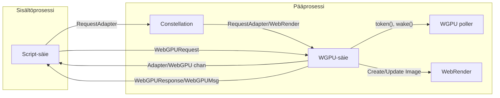

# WebGPU

Servon WebGPU-toteutus perustuu [wgpu(-core)](https://github.com/gfx-rs/wgpu) -kirjastoon, ja se koostuu kahdesta osasta:

- DOM-toteutus
- WGPU-toteutus



### DOM-toteutus

DOM-toteutus sijaitsee [`components/script/dom/webgpu`](https://github.com/servo/servo/tree/main/components/script/dom/webgpu) -hakemistossa, ja se toteuttaa JS-rajapinnat, jotka on määritelty [WebGPU IDL](https://github.com/servo/servo/blob/main/components/script_bindings/webidls/WebGPU.webidl) -tiedostossa ja jotka on altistettu web-alustalle.

Täällä toteutamme vain logiikan, joka on kuvattu WebGPU-spesifikaatiossa [*content timeline*](https://www.w3.org/TR/webgpu/#content-timeline) -osiossa.
Tämä sisältää pääasiassa JS-tyyppien muuntamisen wgpu-types-kuvauksiksi, jotka lähetetään WGPU-säieelle IPC-viesteillä, jotka on määritelty <https://github.com/servo/servo/blob/main/components/shared/webgpu/messages/recv.rs>.
WebGPU on suunniteltu asynkroniseksi, joten WGPU-säieen operaatioiden valmistumista ei tarvitse odottaa.
Tämä tehdään tallentamalla tunnuksia DOM WebGPU -objekteihin, jotka linkittävät WGPU-säieellä eläviin WGPU-objekteihin (joita wgpu-core tarjoaa).
Lisätietoa tästä suunnittelusta on saatavilla [wgpu-repositoriossa](https://github.com/gfx-rs/wgpu/blob/9a8dbfb85cc01d3ede7a94fe248f4e9c28b580eb/wgpu-core/src/hub.rs#L30).

### WGPU-toteutus

Varsinainen käsittely tapahtuu kahdella omistetulla säieellä pääselainprosessissa: yksi [`WGPU`](https://github.com/servo/servo/blob/main/components/webgpu/wgpu_thread.rs):lle ja yksi [WGPU poller](https://github.com/servo/servo/blob/main/components/webgpu/poll_thread.rs):ille.
Nämä säieet käynnistetään laiskasti ensimmäisellä adapter-pyynnöllä.

WGPU-säie toteuttaa [*device timeline*](https://www.w3.org/TR/webgpu/#device-timeline) -osiossa määritellyt vaiheet dispatch:amalla wgpu-core-funktioita vastauksena scriptiltä tuleviin IPC-viesteihin.
Jotkin kutsut herättävät myös WGPU poller -säieen, joka ajaa tehokkaasti [*queue timeline*](https://www.w3.org/TR/webgpu/#queue-timeline) -osioita kutsumalla `poll_all_devices` wgpu-coresta.

## WebGPU CTS -odotusten päivittäminen

WebGPU CTS -odotukset ovat valtavia, joten `mach update-wpt`:n sijaan käytämme [`moz-webgpu-cts`](https://github.com/erichdongubler-mozilla/moz-webgpu-cts) -työkalun [forkkia](https://github.com/sagudev/moz-webgpu-cts/tree/servo) odotusten päivittämiseen.

Odotusten päivittämiseksi sinun täytyy hankkia ajon `wptreport`-loki joko käynnistämällä täysi CTS-ajo CI:ssä (`mach try webgpu`) tai ajamalla tiettyjä testejä paikallisesti:

```sh
$ mach test-wpt -r --log-wptreport report.json [tests ...]
```

Huomaa, että odotukset asetetaan release- ja production-käännöksille, koska debug-käännökset ovat liian hitaita.
Päivitä odotukset seuraavasti:

```sh
$ moz-webgpu-cts --servo process-reports --preset set report.json
```

Voit myös testata Servoa [live CTS:ää](https://gpuweb.github.io/cts/standalone/) vastaan:

```sh
$ mach run -r --pref dom.webgpu.enabled 'https://gpuweb.github.io/cts/standalone/?runnow=1&q=<test>'
```

Tällä hetkellä meillä on useita epävakaita tehtäviä `webgpu:shader,execution,expression` -kategoriassa, joita seurataan [#31397](github.com/servo/servo/issues/31397) -issue:ssa.
Ne voidaan jättää huomiotta, jos ne ilmestyvät try-ajojesi odottamattomiin tuloksiin.

## Työskentely upstream [gfx-rs/wgpu](https://github.com/gfx-rs/wgpu) -projektissa

Servoa voidaan käyttää wgpu-muutosten testaamiseen [WebGPU CTS:ää](https://gpuweb.github.io/cts/) vasten seuraavasti:

1. Päivitä wgpu Servon Cargo.toml:ssa uusimpaan committiin (valinnainen, mutta suositeltavaa jos Servo on vanhentunut)
2. Perusta wgpu-muutoksesi samaan wgpu-committiin, jota Servo käyttää
3. Päivitä wgpu Servon Cargo.toml:ssa haaraan, jossa muutoksesi ovat
4. Testaa muutoksesi käynnistämällä täysi CTS-ajo: `mach try webgpu`
5. Sisällytä linkki testituloksiin wgpu-pull requestiisi

## Lisäresurssit

- [Kävelykierros siitä, miten WebGPU ensin toteutettiin Servossa](https://servo.org/blog/2020/08/30/gsoc-webgpu/)
